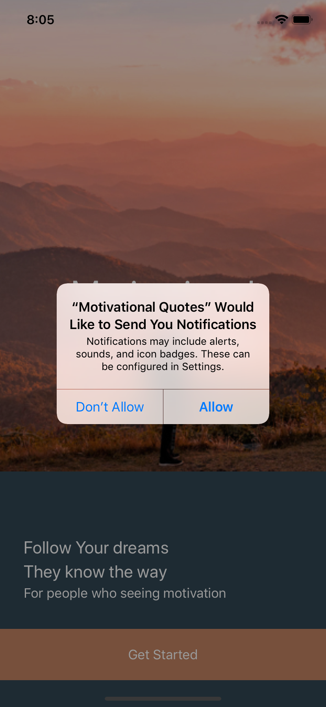
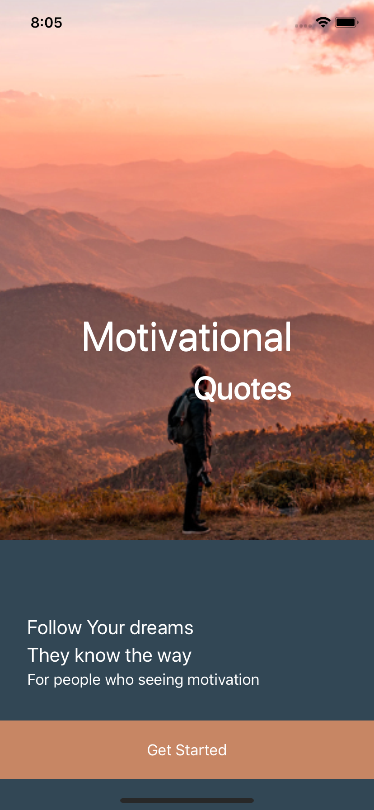
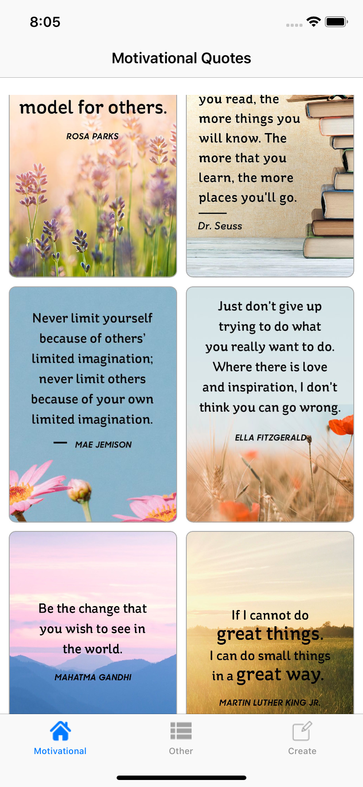
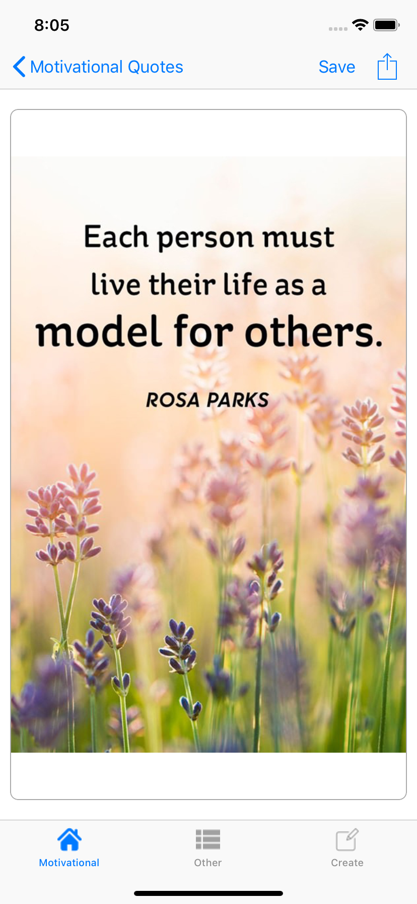
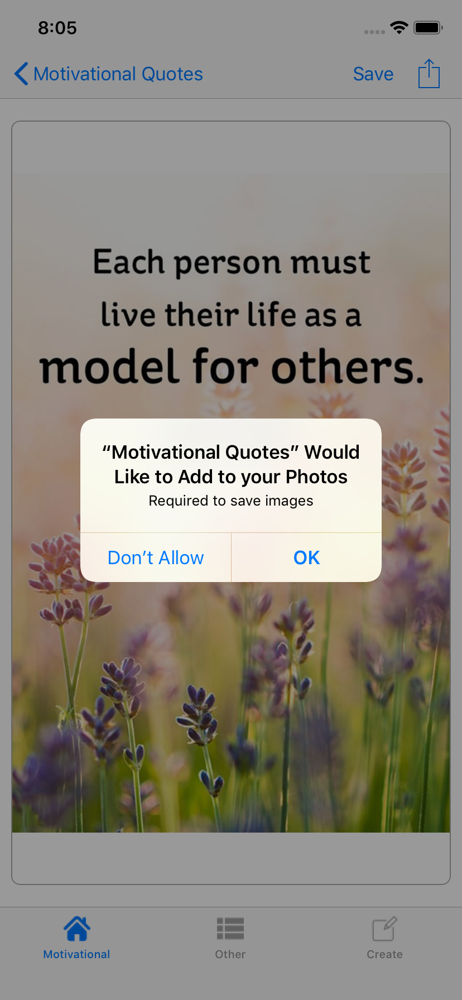
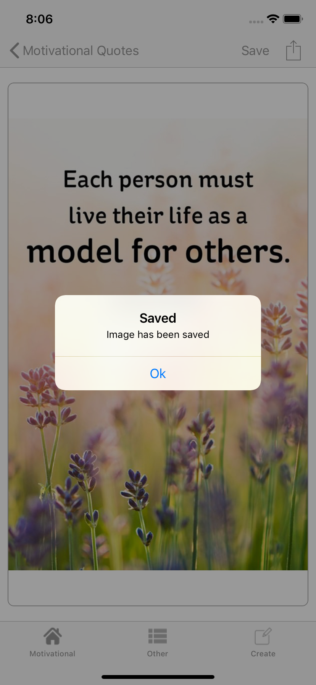
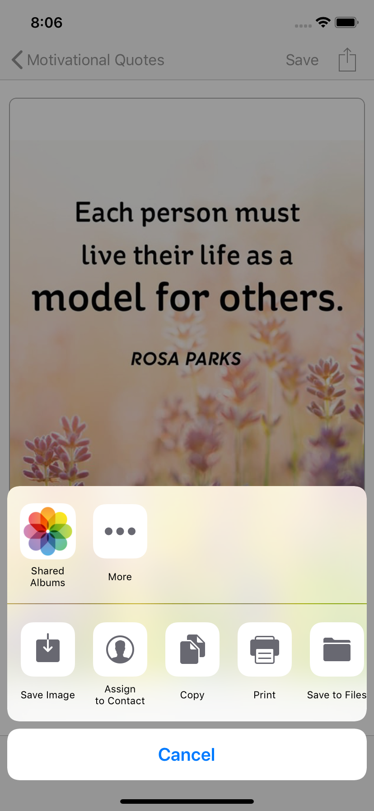
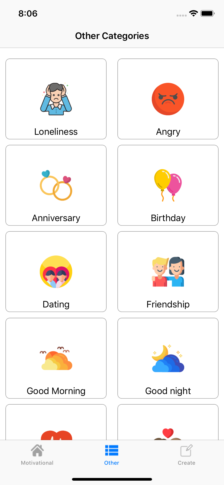
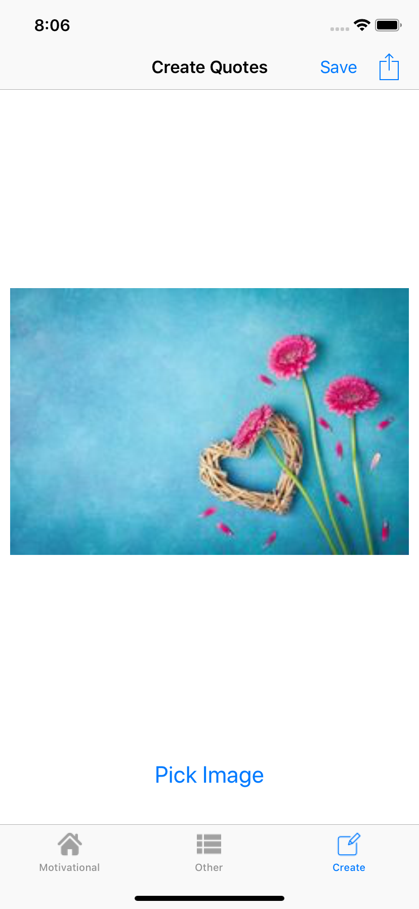

# Mortivatonal-Quotes
This is native android application xcode 10.3, ios 12, swift 4

## Pods for IOSMortivationQuotes
	pod 'iOSPhotoEditor' pod 'Firebase/Core'  pod 'Firebase/Messaging'  pod 'Floaty', '~> 4.2.0'
  
## Animated Screen
   
  
## Screenshots
     
   
   
   
   
   
   
   
  
